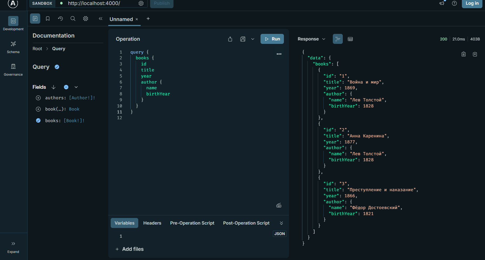
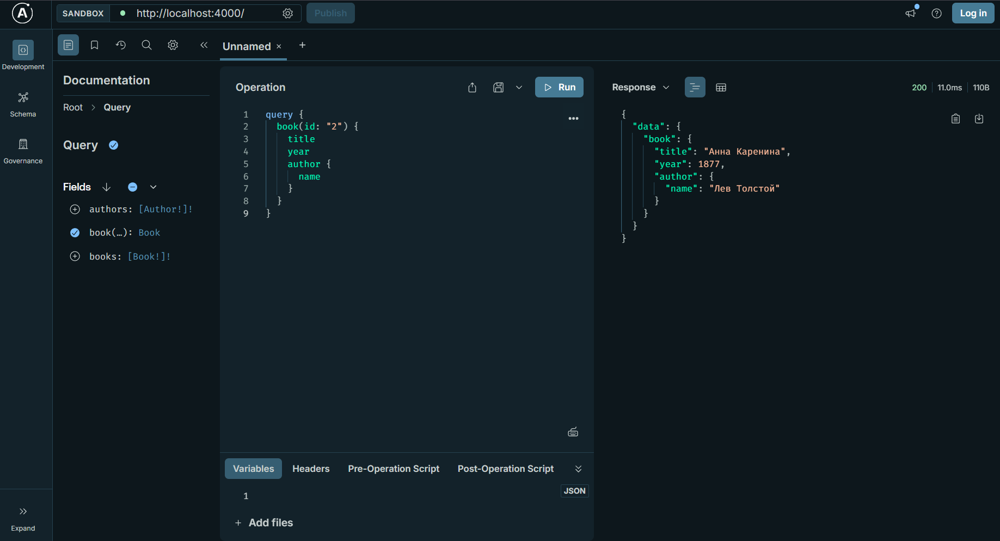
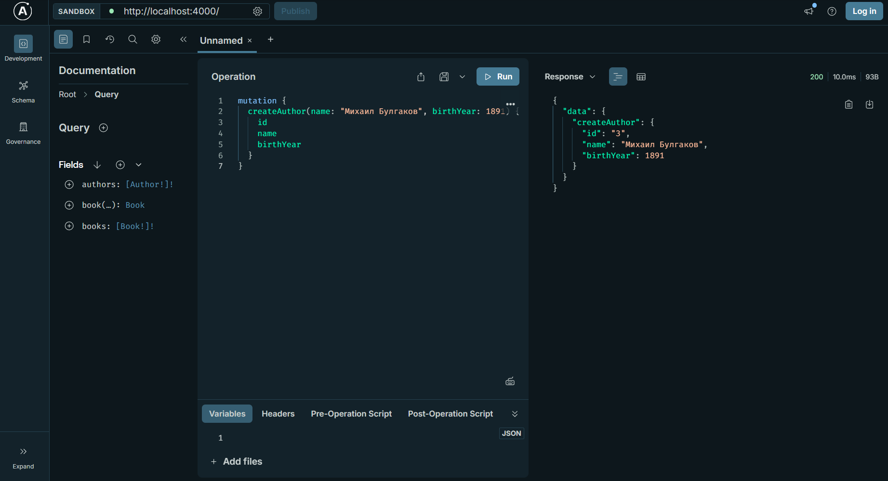

# Практическое занятие 26

## Проверка в Apollo Server

### Получение всех книг с авторами

```
query {
  books {
    id
    title
    year
    author {
      name
      birthYear
    }
  }
}
```



### Получение одной книги по id

```query {
  book(id: "2") {
    title
    year
    author {
      name
    }
  }
}
```



### Создание нового автора

```mutation {
  createAuthor(name: "Михаил Булгаков", birthYear: 1891) {
    id
    name
    birthYear
  }
}
```

